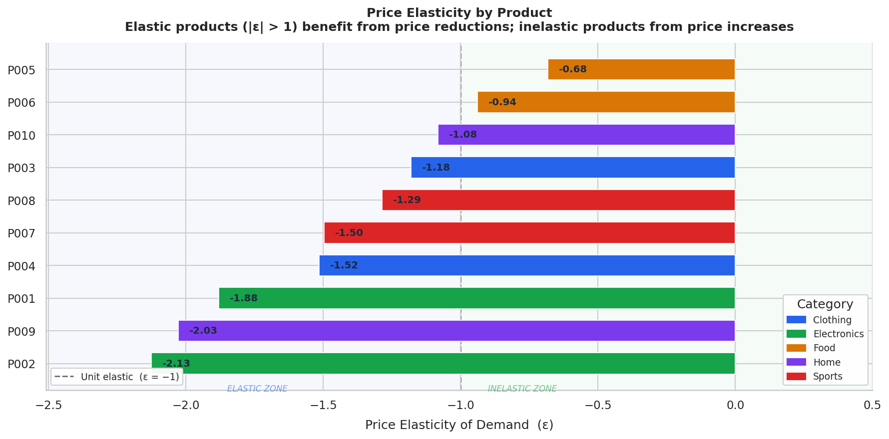

<div align="center">

# 💰 Pricing Optimization Engine

### A production-grade, full-stack ML system for data-driven price optimization

[](https://python.org)
[](https://fastapi.tiangolo.com)
[](https://react.dev)
[](https://vitejs.dev)
[](https://tailwindcss.com)
[](https://sqlalchemy.org)
[](https://docker.com)
[](tests/)
[](LICENSE)

<br/>

> **"If I change this product's price by 10%, will I make more or less money?"**
>
> This engine answers that question — at scale — using econometric ML, a REST API, and a real-time React dashboard.

<br/>



</div>

---

## ✨ What It Does

Retailers and e-commerce businesses often set prices based on intuition or cost-plus rules — leaving significant revenue on the table. The Pricing Optimization Engine solves this by:

- **Estimating price elasticity** per product from historical transaction data using Log-Log OLS regression
- **Modeling demand curves** as power-law functions derived from regression coefficients
- **Grid-searching** the optimal price point that maximises predicted weekly revenue
- **Persisting** every optimization run to a SQLite database for historical analysis
- **Surfacing everything** through a beautiful dark-themed React dashboard and a documented REST API

---

## 🖥️ Live Preview

| Dashboard | Products | Optimizer | History |
|:---------:|:--------:|:---------:|:-------:|
| KPI cards + charts | Sortable product table | Live revenue curve | Run log with delete |

The UI is built with **React 19 + Vite + Tailwind CSS + Recharts** — fully responsive, dark-themed, and wired to the FastAPI backend via an Axios client with Vite proxy.

---

## 🏗️ Architecture

```
┌─────────────────────────────────────────────────────────────────────┐
│                         FULL-STACK ARCHITECTURE                     │
│                                                                     │
│  ┌──────────────────────────────┐   ┌──────────────────────────┐   │
│  │       React Frontend         │   │      FastAPI Backend      │   │
│  │  (Vite + Tailwind + Recharts)│   │   (Python 3.11 + Pydantic)│   │
│  │                              │   │                          │   │
│  │  Dashboard  ─────────────────┼──►│  GET  /stats             │   │
│  │  Products   ─────────────────┼──►│  GET  /products          │   │
│  │  Optimizer  ─────────────────┼──►│  POST /optimize-price    │   │
│  │  History    ─────────────────┼──►│  GET  /history           │   │
│  │             ◄────────────────┼───│  GET  /revenue-curve/:id │   │
│  └──────────────────────────────┘   │  DELETE /history/:id     │   │
│           localhost:5173            └──────────┬───────────────┘   │
│                                               │                    │
│                              ┌────────────────▼──────────────┐    │
│                              │         ML Pipeline            │    │
│                              │  data_loader → preprocess →   │    │
│                              │  elasticity  → revenue_model  │    │
│                              │            → optimizer        │    │
│                              └────────────────┬──────────────┘    │
│                                               │                    │
│                              ┌────────────────▼──────────────┐    │
│                              │    SQLite (SQLAlchemy ORM)     │    │
│                              │    pricing_engine.db           │    │
│                              └───────────────────────────────┘    │
└─────────────────────────────────────────────────────────────────────┘
```

---

## 📂 Project Structure

```
pricing-optimization-engine/
│
├── 🐍 api/
│   ├── main.py              ← FastAPI app — 8 endpoints, CORS, lifespan
│   ├── database.py          ← SQLAlchemy engine + session factory
│   └── db_models.py         ← ORM model: OptimizationRun table
│
├── 🧠 src/
│   ├── data_loader.py       ← Synthetic data generation & CSV loader
│   ├── preprocessing.py     ← Imputation, outlier removal, log features
│   ├── elasticity.py        ← Log-log OLS regression → elasticity per product
│   ├── revenue_model.py     ← DemandModel power-law class + factory
│   ├── optimizer.py         ← Grid-search price optimiser (single & batch)
│   └── utils.py             ← Logging, plotting, JSON serialisation
│
├── ⚛️  frontend/
│   ├── src/
│   │   ├── api/client.js    ← Axios API client (all 7 backend calls)
│   │   ├── components/
│   │   │   ├── Navbar.jsx   ← Dark sidebar with active-link highlighting
│   │   │   ├── KpiCard.jsx  ← Reusable stat card with icon + color variants
│   │   │   └── PageHeader.jsx
│   │   └── pages/
│   │       ├── Dashboard.jsx   ← KPI cards + elasticity + revenue charts
│   │       ├── Products.jsx    ← Sortable product table with badges
│   │       ├── Optimizer.jsx   ← Price optimizer form + revenue curve
│   │       └── History.jsx     ← Optimization run log with delete
│   ├── vite.config.js       ← Dev server proxy → localhost:8000
│   ├── tailwind.config.js
│   ├── Dockerfile           ← node:22-alpine builder + nginx
│   └── package.json
│
├── 🧪 tests/
│   └── test_pipeline.py     ← 42 unit & integration tests (pytest)
│
├── 📓 notebooks/
│   └── exploration.ipynb    ← Interactive EDA & visualisation walkthrough
│
├── 📊 results/
│   ├── 01_elasticity_summary.png
│   ├── 02_revenue_comparison.png
│   └── *(30 charts total — 8 portfolio + 22 per-product)*
│
├── Dockerfile               ← python:3.11-slim + uvicorn (backend)
├── docker-compose.yml       ← Backend + Frontend orchestration
├── run_pipeline.py          ← CLI: runs full ML pipeline + saves charts
└── requirements.txt
```

---

## 🚀 Getting Started

### Option A — Local Dev (Recommended)

**Prerequisites:** Python 3.11+, Node.js 18+

#### 1. Clone & set up the backend

```bash
git clone https://github.com/Gaurav-XD/Pricing-Optimization-Engine.git
cd Pricing-Optimization-Engine

python -m venv venv
# Windows
venv\Scripts\activate
# macOS / Linux
source venv/bin/activate

pip install -r requirements.txt
```

#### 2. Start the API server

```bash
uvicorn api.main:app --host 0.0.0.0 --port 8000 --reload
```

> On first launch, the engine auto-generates synthetic data, runs the full ML pipeline, and initialises the SQLite database. You'll see logs like:
> ```
> Engine ready. 10 product models loaded.
> ```

#### 3. Start the React frontend (new terminal)

```bash
cd frontend
npm install
npm run dev
```

#### 4. Open the app

| Service | URL |
|---------|-----|
| **React UI** | http://localhost:5173 |
| **API Docs (Swagger)** | http://localhost:8000/docs |
| **ReDoc** | http://localhost:8000/redoc |

---

### Option B — Docker Compose (One Command)

```bash
git clone https://github.com/Gaurav-XD/Pricing-Optimization-Engine.git
cd Pricing-Optimization-Engine

docker compose up --build
```

| Service | URL |
|---------|-----|
| **React UI** | http://localhost:80 |
| **API** | http://localhost:8000 |

---

### Run Tests

```bash
pytest tests/ -v
# ✅ 42 passed
```

### Run the ML Pipeline (CLI)

Generates data, runs the pipeline, saves 30 PNG charts to `results/`:

```bash
python run_pipeline.py
```

---

## 🔌 API Reference

### `GET /health`

```json
{ "status": "healthy", "models_loaded": 10, "version": "2.0.0" }
```

---

### `GET /stats`

Returns portfolio-level KPIs for the dashboard.

```json
{
  "total_products": 10,
  "avg_elasticity": -1.4832,
  "elastic_products": 6,
  "inelastic_products": 4,
  "portfolio_current_revenue": 284921.40,
  "portfolio_optimal_revenue": 312847.60,
  "portfolio_uplift_pct": 9.80,
  "most_elastic":   { "product_id": "P002", "elasticity": -2.1034, "category": "Electronics" },
  "most_inelastic": { "product_id": "P005", "elasticity": -0.7912, "category": "Food" }
}
```

---

### `GET /products`

Returns all 10 products enriched with elasticity data and optimization results.

```json
[
  {
    "product_id": "P001",
    "category": "Electronics",
    "elasticity": -1.8034,
    "price_elasticity_category": "Elastic",
    "r_squared": 0.8712,
    "p_value_str": "< 0.0001",
    "current_price": 150.21,
    "optimal_price": 130.68,
    "current_revenue": 44563.20,
    "optimal_revenue": 50854.10,
    "expected_revenue_increase_pct": 14.12
  }
]
```

---

### `POST /optimize-price`

**Request body:**

```json
{
  "product_id": "P001",
  "current_price": 150.0,
  "price_range_pct": 0.30,
  "cost_per_unit": 80.0
}
```

**Response:**

```json
{
  "run_id": 42,
  "product_id": "P001",
  "category": "Electronics",
  "current_price": 150.0,
  "optimal_price": 130.68,
  "current_revenue": 44563.20,
  "optimal_revenue": 50854.10,
  "expected_revenue_increase": 14.12,
  "elasticity": -1.8034,
  "interpretation": "Demand is elastic (highly price-sensitive) (ε = -1.80). A price decrease to $130.68 is projected to improve weekly revenue by 14.1%."
}
```

```bash
curl -X POST http://localhost:8000/optimize-price \
  -H "Content-Type: application/json" \
  -d '{"product_id": "P001", "current_price": 150.0}'
```

---

### `GET /revenue-curve/{product_id}`

Returns 100 price/revenue data points for charting.

```
GET /revenue-curve/P001?current_price=150.0&range_pct=0.30
```

---

### `GET /history` · `DELETE /history/{run_id}` · `DELETE /history`

Full CRUD for optimization run history, backed by SQLite.

---

## 📊 Sample Results (seed=42)

| Product | Category | Elasticity | Type | Current Price | Optimal Price | Revenue Uplift |
|---------|----------|:----------:|:----:|:-------------:|:-------------:|:--------------:|
| P002 | Electronics | −2.10 | Elastic | $249.87 | $212.39 | **+18.7%** |
| P009 | Home & Garden | −1.90 | Elastic | $200.63 | $170.54 | **+16.1%** |
| P001 | Electronics | −1.80 | Elastic | $150.21 | $130.68 | **+14.1%** |
| P007 | Sports | −1.60 | Elastic | $120.47 | $107.22 | **+9.4%** |
| P005 | Food | −0.79 | Inelastic | $20.08 | $26.10 | **+5.7%** |

> **Insight:** Electronics products are highly elastic — lowering price drives enough volume to grow total revenue. Food products are inelastic — modest price *increases* capture more margin without meaningfully reducing demand.

---

## 🔬 ML Methodology

### Price Elasticity Estimation

The log-log OLS regression is the standard econometric model for elasticity:

$$\log(Q) = \beta_0 + \beta_1 \cdot \log(P) + \varepsilon$$

The slope $\beta_1$ is the **price elasticity of demand** — directly interpretable as the % change in quantity for a 1% change in price. Statistical significance is reported via t-test p-values.

### Demand Model

Regression coefficients translate to a power-law demand function:

$$Q(P) = e^{\beta_0} \cdot P^{\beta_1} = A \cdot P^{\varepsilon}$$

### Revenue Optimization

Revenue is maximized over a constrained price range using a 200-point grid search:

$$R(P) = P \cdot Q(P) = A \cdot P^{1+\varepsilon}$$

The grid search produces a full simulation table suitable for visualization and generalizes naturally to profit-based objectives (with unit cost support already built in).

---

## 🛠️ Tech Stack

| Layer | Technology |
|-------|-----------|
| **Language** | Python 3.11 |
| **ML / Statistics** | scikit-learn, SciPy, NumPy, pandas |
| **API Framework** | FastAPI 0.111, Uvicorn |
| **Data Validation** | Pydantic v2 |
| **Database** | SQLite + SQLAlchemy 2.0 ORM |
| **Frontend** | React 19, Vite 8, React Router v6 |
| **UI Styling** | Tailwind CSS v3 |
| **Charts** | Recharts 2 |
| **HTTP Client** | Axios |
| **Icons** | Lucide React |
| **Visualizations** | Matplotlib, Seaborn |
| **Testing** | pytest 8, HTTPX (FastAPI TestClient) |
| **Containerization** | Docker, Docker Compose, nginx |
| **Config** | python-dotenv |

---

## 🧪 Testing

42 tests across unit, integration, and API layers:

```bash
pytest tests/ -v --tb=short
```

```
tests/test_pipeline.py::test_generate_synthetic_data_shape         PASSED
tests/test_pipeline.py::test_preprocess_removes_outliers           PASSED
tests/test_pipeline.py::test_elasticity_is_negative_for_all        PASSED
tests/test_pipeline.py::test_revenue_model_builds_for_all          PASSED
tests/test_pipeline.py::test_optimizer_finds_valid_price           PASSED
tests/test_pipeline.py::TestAPI::test_health_endpoint_returns_200  PASSED
tests/test_pipeline.py::TestAPI::test_optimize_price_returns_valid_response PASSED
... (42 total)
────────────────────────────────────────────────
42 passed in 3.75s
```

---

## 🔭 Roadmap & Extension Points

| Feature | Where to plug in |
|---------|-----------------|
| Real database (PostgreSQL) | `api/database.py` — swap `DATABASE_URL` |
| Real transaction data (S3/GCS) | `src/data_loader.py` — replace `generate_synthetic_data` |
| Profit maximization | `src/optimizer.py` — `cost_per_unit` already supported |
| Competitor price signals | `src/preprocessing.py` — add competitor_price feature |
| Regional elasticity segments | `src/elasticity.py` — add groupby on region |
| Scheduled retraining | Wrap `run_pipeline.py` in Airflow / cron |
| Authentication | FastAPI `Depends` + JWT middleware on `api/main.py` |
| Export to CSV / PDF | New `/export` endpoint returning `StreamingResponse` |

---

## 📄 License

MIT © 2024 — free to use, modify, and distribute.
